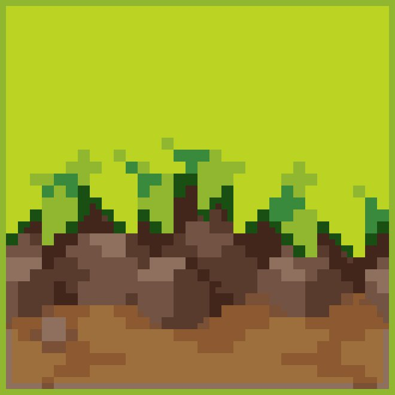

# Example

## Chapter 1

This is just Example

[Test Web URL](https://github.com)

## Chapter 2

### Figure1

Figure from remote web


### Figure2

Figure from current folder



## Chapter 3

Test markdown

```bash
#!/bin/bash

echo "Hello World"
```

> It's a quote

    Just Monika

## Chapter 4

Test html

<h1>H1 Html</h1>
<h2>H2 Html</h2>
<h3>H3 Html</h3>
<h4>H4 Html</h4>
<h5>H5 Html</h5>
<h6>H6 Html</h6>

<table>
<thead>
<tr>
<th>NFA</th>
<th>DFA</th>
<th>a</th>
<th>b</th>
</tr>
</thead>
<tbody>
<tr>
<td>{0}</td>
<td>A</td>
<td>B</td>
<td></td>
</tr>
<tr>
<td>{1,2,3,5,8}</td>
<td>B</td>
<td>C</td>
<td>D</td>
</tr>
<tr>
<td>{2,3,4,5,7,8,<b>9</b>}</td>
<td><b>C</b></td>
<td>C</td>
<td>D</td>
</tr>
<tr>
<td>{2,3,5,6,7,8}</td>
<td>D</td>
<td>C</td>
<td>D</td>
</tr>
</tbody>
</table>